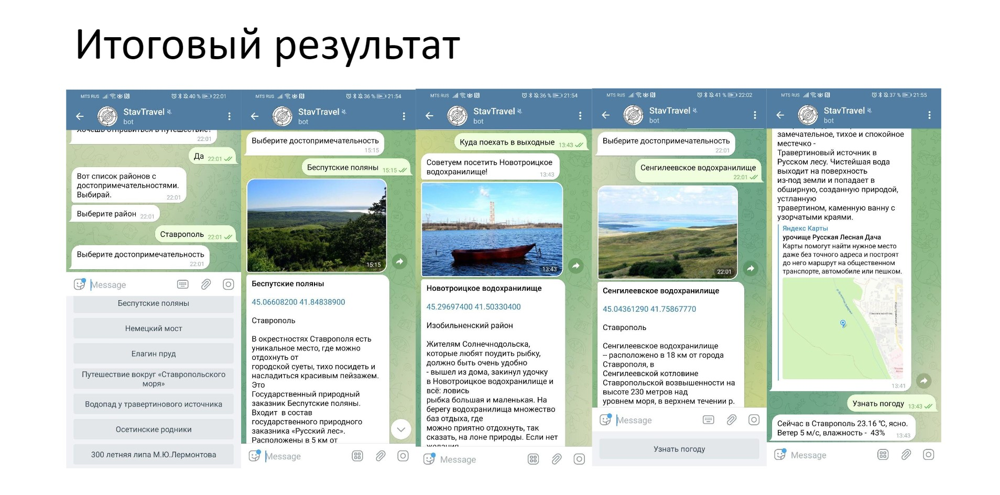

# StavTravel_bot
---
### Думаю многие люди любят путешествовать и большинство из таких людей задаются вопросом. «Куда можно поехать?» Чтобы помочь им определиться с этим я решил сделать Telegram бота на python, который обязательно найдёт место куда можно отправиться в путешествие по Ставропольскому краю.
---
### При первом запуске бот приветствует пользователя и предлагает отправиться в путешествие. В зависимости от ответа пользователя бот предложит выбрать район или же сразу достопримечательность. Если пользователь выбирает кнопку «По районам», то бот выводит список всех районов в Ставропольском крае. После выбора района появится список всех достопримечательностей в выбранном районе. Как только пользователь выбрал достопримечательность, бот выводит всю информацию о ней. Так же можно ввести сразу интересующую достопримечательность или район, необязательно следовать алгоритму. 

## В информацию о достопримечательности входит:
#### Название
#### Координаты
#### Описание
#### Фото

### В выбранном месте можно узнать погоду, для этого нужно просто нажать соответствующую кнопку или же написать «Узнать погоду».
### Также есть функция для автоматического подбора места для посещения на выходных. Она определят погоду в ближайшие выходные и зависимости от этого советует посетить одно из мест. Чтобы её активировать нужно спросить у бота «Куда поехать в выходные?».

### В проекте используются api и сторонние библиотеки.
## Бот в telegram - @StavTravel_bot
## Бот полностью функционирует и им можно пользоваться, удачных путешествий!

